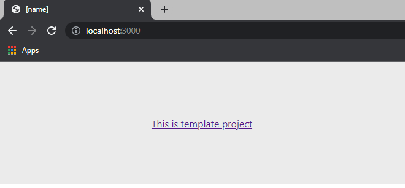
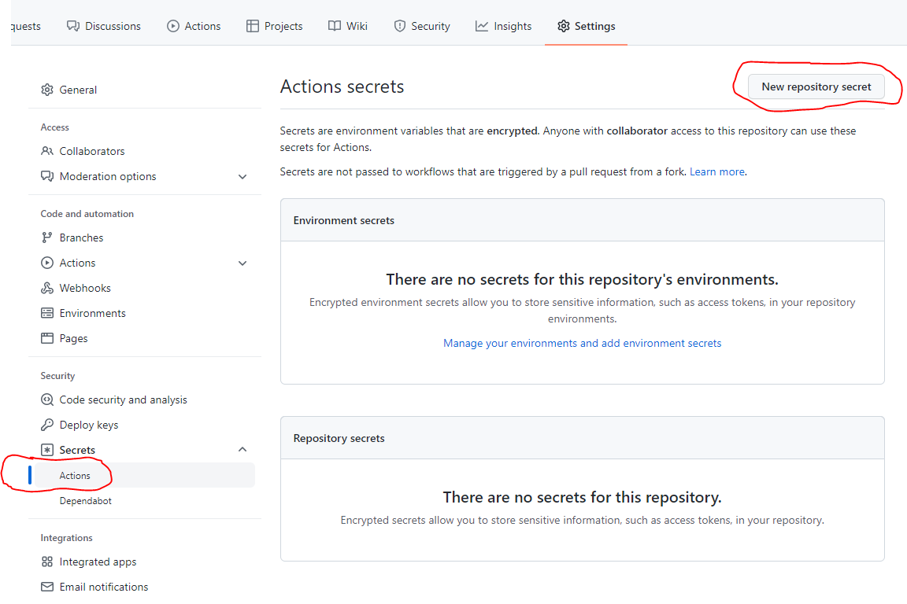

# Boilerplate static web site project
```
GitHub Actions Deploy: AWS, S3
Language: TypeScript
Build: Webpack, Next.js
Front-end framework: React.js
CSS framework: Styled-Components
Code Style: EsLint, Prettier
```

## Usage

#### 1) Find in code and replace
```
[domain]
[name]
[analytics_js_code]
```
#### 2) Run in terminal
```
npm i
npm run dev
```
#### 3) Open in browser
```
http://localhost:3000/
```
#### 4) See

#### 5) Make changes
#### 6) Enjoy!

## Deploy

#### 1) Create AWS S3 Backed
#### 2) Create [Github Actions Secrets](https://docs.github.com/en/actions/security-guides/encrypted-secrets)
[GitHub workflow](https://docs.github.com/en/actions/learn-github-actions/understanding-github-actions) file:
> .github/workflows/deploy.yml

Secrets keys:
```
AWS_ACCESS_KEY_ID
AWS_SECRET_ACCESS_KEY
AWS_REGION
AWS_S3_BUCKET
```


## Git version tags

Automatically updates the patch version with each deploy

```
0.0.1 -> 0.0.2 -> etc.
```

file:
> config/ci/git-version-tag.sh
